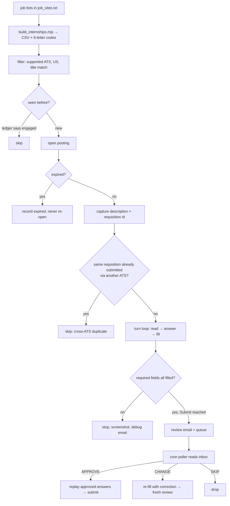

# Design — x8skill-jobapp (as built)

This describes the system **as it actually works**, not as it was originally proposed. Every
mechanism below exists because something specific went wrong; where that is the case the
failure is named, because the failure is the reason the code looks the way it does.

Companion documents: `CLAUDE.md` holds the terse invariants and per-ATS quirks an agent must
not break. `README.md` is the quick start. This file is the reasoning.

---

## 1. What this is

Playwright + TypeScript automation that applies to US software-engineering internships on
Workday, Greenhouse, Ashby and Lever. It reads job lists, decides whether a posting is new,
opens the application, fills it from the candidate's profile / resume / curated Q&A, and then
**stops at the Review step and emails the filled application for approval**.

The hard rule: **nothing is ever submitted without explicit human approval** — either an
emailed `APPROVE` reply, or a typed confirmation in the terminal during the short grace wait.
Approval is matched to a job by its unique 6-letter code only.

Non-goals: defeating CAPTCHAs, applying to roles outside the SWE/AI-ML filter, or answering
EEO questions from anything other than the candidate's own recorded answers.

---

## 2. Life of one job



Two phases, deliberately decoupled: the fill run never waits for approval (it can take days),
and the poller never fills from scratch on approval (it replays).

---

## 3. Sources and filtering

`tools/build_internships.mjs` fetches every list in `job_sites.txt` (Simplify, vanshb03,
interndock), parses the tables, filters by title (`INCLUDE`/`EXCLUDE` regexes — firmware, PM,
design, quant-trading are excluded), classifies region, and writes
`internships_summer2027.csv` + `.md`. `src/sources/internshipList.ts` loads the CSV.

**The 6-letter code** (`DVDFRR`) is `fnv1a(posting URL)` mapped to letters. It is
deterministic, so a role keeps its code across rebuilds — which matters because the code is
the queue key and the only thing an approval reply is matched on. Collisions are salted, so a
new posting colliding with an old one can in principle reassign a code; with ~200 jobs over
26⁶ that is vanishingly unlikely but not impossible.

`SKIP_REFRESH=1` reuses the existing CSV rather than rebuilding — used when re-running
specific jobs so codes and URLs cannot churn mid-flight.

---

## 4. Job identity — what makes two listings "the same job"

`src/core/jobIdentity.ts`, `src/core/requisitionId.ts`, `src/knowledge/applications.ts`.

An ATS posting id identifies a **listing**, not a **job**. The same opening is often posted
through more than one channel, each with its own id, so ATS ids alone permit applying twice.

| Signal | Field | Strength | Availability (measured on live postings) |
|---|---|---|---|
| Employer requisition id | `companyReqId` | **Spans ATS** | Workday nearly always (`R73630`); Greenhouse sometimes (`JR11987`); Lever/Ashby never |
| ATS posting id | `externalJobId` | Exact listing | Greenhouse `/jobs/<n>`, Ashby/Lever UUID, else `sha1(url)` |
| `company::externalJobId` | `identityKey` | Ledger primary key | always |
| Normalized apply URL | `normalizedApplyUrl` | Exact listing | always |
| 6-letter code | `code` | Human/email handle | from the CSV build |
| Company + title (+ location) | — | **Suspicion only** | always |

`sameJob()` matches on **any** hard route, so a job stays recognisable when one identifier
changes. The requisition id is an *additional* route, not a replacement — `identityKey` stays
ATS-derived so records written before requisition ids existed keep matching, with no
migration.

Requisition ids usually appear only in the page body, so identity is **upgraded** after the
posting opens (`withRequisitionId`). Everything downstream must work when it is `undefined`.

`findCrossAtsDuplicate` hard-blocks the case ATS ids cannot see: a *different* listing,
already submitted, sharing this employer's requisition id.

**Company + title never hard-blocks.** RTX posts two distinct "Software Engineer Intern"
requisitions (Burnsville MN and Largo FL); merging them would silently drop a real
application. `classifyJobMatch` therefore returns a graded verdict:

| Situation | Decision | Confidence | Action |
|---|---|---|---|
| Same requisition id | `same_job` | 1.0 | block |
| Same ATS id / URL | `same_job` | 0.95 | block |
| Same company+title, same location, similar text | `possibly_same_job` | 0.55–0.9 | **ask the user** |
| Same company+title, different location | `possibly_same_job` | 0.2–0.5 | **ask the user** |
| Nothing matches | `distinct` | 0 | proceed |

Anything uncertain carries `needsHumanConfirmation` and renders as a confidence-scored
"possible duplicate" block in the review email. For Lever/Ashby (no requisition id) the
corroborating signal is x8note's semantic search, not local text comparison.

Requisition-id extraction accepts **labelled** all-digit ids ("Job ID: 01865635") but
unlabelled matches must have a letter prefix (`R`/`JR`/`REQ`) — bare digits collide with
years, salaries and counts. Cases in `src/debug/reqIdCases.ts`.

---

## 5. Reading a form

`src/agent/drivers/base.ts` — the `READ_SCRIPT` runs in the page and returns a `FieldSpec[]`:
key, label, type, required, options, widget, `searchable`, `filled`, and group identity.

`page.evaluate()` is always passed a **string**, and it must be an invoked IIFE
(`"(() => {…})()"`). tsx/esbuild rewrites inline arrow functions with helpers (`__name`) that
don't exist in the page, and a non-invoked arrow string silently returns `undefined` — that
bug left 32 of the first 33 applications with no job description at all.

### Label resolution is the single largest source of bugs

Three separate outages came from a label losing its question, and the agent then answering
blind:

| ATS shape | Where the question lives | Symptom when missed |
|---|---|---|
| Lever custom question | `li.application-question` → `.application-label`, control in a sibling `.application-field` | label became the raw name `cards[<uuid>][field5]` |
| Checkbox group | nearest ancestor holding **only** checkboxes (2–15) | bare options "Computer Science", "Putnam", "Handshake"; 13 unanswerable fields |
| Date sub-fields | enclosing `formField` / legend, walked up 2 levels | 44 fields labelled `Month`, 52 labelled `Year`; the agent wrote a start of 12/2025 against an end of 4/2025 and Workday rejected the page with "Must end before start date" |
| Workday / Ashby | `[data-automation-id^="formField"]`, `[class*="fieldEntry"]` | question read as "choice" |

Group detection deliberately requires a container holding *nothing but* checkboxes. An earlier
version accepted any ancestor with two checkboxes and swept in unrelated fields from
elsewhere on the page.

### Widget classification

- `react-select` — `role=combobox` or a `select__*` ancestor.
- **Workday prompts** — a bare `<input>` inside `multiSelectContainer` with no role and no
  `select__` class. Until this was recognised the field was read as free text: no options
  captured, the agent answered from general knowledge ("LinkedIn" when the tenant offered only
  Advertising / Employee Referral / Job Board / Networking / Social Media), and the value was
  typed in. Workday reported "0 items selected" and refused to advance.
- `searchable` — a type-to-filter combobox whose captured options are an async **sample**, not
  an allowlist (Greenhouse's School field returns 100 entries starting at "Aalborg
  University"). Workday prompts are explicitly *not* searchable: their list is short and
  complete, so the agent must choose from it.

### `filled` detection per widget

react-select stores its value in a `single-value` node; Workday commits a `selectedItem` row
and its label reads "N items selected". Looking only for react-select's marker reported
Workday's `Country Phone Code` as empty when it was in fact selected, and the gate blocked an
already-answered field.

---

## 6. Answering

`src/agent/llmAgent.ts`. Grounding: parsed profile, resume text, curated Q&A (authoritative),
the job description, and any emailed correction. AIROUTER first, Gemini as fallback.

Guardrails, each with the failure it prevents:

| Guardrail | Prevents |
|---|---|
| Sensitive fields (work auth, demographics, salary, DOB) answered **only** from curated Q&A | invented legal/demographic answers |
| Select values must match a real option | a value that cannot exist in the form |
| …**except** `searchableTypeahead`, where `optionsSample` is a slice | the model deferring School\* because "Carnegie Mellon" wasn't in the first 100 options — which blocked 9 of 30 jobs |
| Bare "Yes"/"No" refused in a free-text field unless the label reads as a yes/no question | the curated "Do you have a preferred name? → No" landing in Lever's text field "What would you like us to call you?", submitting the word "No" as a name |
| `blank: true` for an optional field the candidate genuinely has nothing for | a phone extension being reported as "no answer available" |
| Open-ended prose is drafted and flagged `draft` | unreviewed prose being submitted silently |

Robustness: replies are parsed with an unpaired-fence-tolerant extractor that repairs a
truncated array by keeping the objects that arrived whole and **logging what it recovered**
(`src/debug/parseCases.ts`). `max_tokens` is 8192 — 2048 cut the array mid-answer on 20+ field
pages and lost every answer in the turn. Gemini runs with `thinkingBudget: 0`, because
reasoning counts against `maxOutputTokens` and on a 64-field page it spent the entire budget
thinking and returned only ` ```json `.

---

## 7. Filling

Per type in `src/agent/drivers/base.ts`, with Workday overrides in `src/agent/drivers/workday.ts`.

- **Comboboxes** — open, type to filter, click the matching option **by its own text**, then
  require a committed selection before reporting success. On a Workday prompt, clicking the
  `role="option"` node (`menuItem`) does nothing — measured, it leaves "0 items selected" —
  while `promptOption` commits; `menuItem` comes first in DOM order, so a selector matching
  both always clicked the dead node. `ArrowDown + Enter` is the verified fallback.
  The search box is cleared before typing, or a retry searches `"Job BoardJob Board"`.
  Options are scoped to the open `activeListContainer`, or a neighbouring field's committed
  pill leaks in as an option.
- **Checkboxes** — "No" means *leave the box clear* and is a successful answer, not a failure.
  Reporting failure put every Workday "I have a preferred name" into "no answer available"
  with the answer sitting in `Q&A.txt` the whole time. Custom widgets hide the real input, so
  the label is clicked as a fallback.
- **Radios** — the visible control is clicked through a cascade (`check`, `label[for]`,
  parent, grandparent, forced) and verified with `isChecked` after each.
- **Dates** — ISO for native inputs; typed + Enter + Escape for text pickers.

Nothing reports success without verification. Returning `true` straight after a click is what
made "How Did You Hear About Us?\*" show a checkmark on every turn while staying empty.

---

## 8. The turn loop and the required-field gate

`src/agent/turnLoop.ts`. Each turn: read the page → ask the agent → fill → **re-read** → gate
→ advance. The gate never lets the run advance (or reach Review) while a required field is
empty.

- **Trust, but only twice.** Workday widgets sometimes report `filled=false` when they are
  set, so a successful fill is trusted — for `TRUST_LIMIT = 2` rounds. Trusting it forever is
  how a field that silently never took a value escaped the gate: neither retried nor blocked,
  and the loop span all 18 turns on one page.
- **Group gate.** "Please check one of the boxes below:\*" marks the *question* required while
  no individual box is. Per-field checks accepted three untouched boxes as answered, so a
  required pick-exactly-one ended with nothing picked. A required group with nothing ticked is
  reported as one blocked entry.
- **Stuck detection** compares the *set of field labels* plus whether any **new** label was
  filled. Comparing a cumulative count never fired, because re-filling the same fields each
  turn kept the count rising.
- **Validation errors.** A page can be fully filled and still refuse to advance. The driver
  reads the form's own error messages (`errorMessage`, `role=alert`) and reports them, so
  "Must end before start date" is named rather than reported as a vague stall.

Two distinct outcomes are tracked separately, because conflating them made the emails
impossible to interpret:

- `unknown` — **no answer available**; the field was never attempted. Logged as
  `– no answer available, left for you: …` (this branch used to be silent, which hid two bugs).
- `failedToFill` — attempted, but the widget refused the value. Logged as `✗ tried but the
  field would not take it: …`.

---

## 9. Human in the loop

`src/knowledge/reviewEmail.ts`. All mail goes out via `gog` to both the applicant address and
the monitored inbox.

- **Review email** (HTML + plain text): meta table with requisition id and posting link, a
  confidence-scored duplicate warning when one exists, every question with its answer, drafts
  badged "draft — please review", the full job description, and the full-page screenshot
  attached.
- **Blocked/debug email**: sent when a job stops before Review, with the screenshot and two
  separate lists (never attempted vs tried-and-failed). It deliberately carries **no**
  approve/skip wording — a blocked job is never queued, so no reply can act on it.
  `NO_DEBUG_EMAIL=1` silences it.

---

## 10. Approval and submission

`src/core/applyJob.ts` (modes `fill` / `submit`), `src/approvals.ts` (the poller),
`src/knowledge/approvalQueue.ts`.

Phase A (`npm start`): fill → reach Review → email → short grace wait
(`APPROVE_TIMEOUT_MS`, default 2 min) → enqueue → move on. `NO_SUBMIT=1` skips the grace wait
entirely: email and queue, never submit during the fill.

Phase B (`npm run approvals`, cron every 15 min): classify each reply three ways.

- **APPROVE** → `mode: "submit"` with a `ReplayAgent` that replays the **exact approved
  answers** with no LLM involved, then submits. This is what makes "submitted == approved"
  true rather than aspirational.
- **CHANGE** → `mode: "fill"` with `changeInstruction`, emails a fresh review, requeues. The
  original reply is marked processed so only a new APPROVE acts next.
- **SKIP** → dropped.

**Attribution is by the 6-letter code only, never company or title.** Matching by company
cross-contaminates roles at one employer — an approval for Cybernetic Labs `WVJGTG` would
otherwise submit `KDUGRO`. A job with no code is never auto-acted on.

**An APPROVE sent from the monitored account counts.** The review email is addressed to
`myao@studiox8.com` too, so a reply written from there is labelled `SENT` by Gmail. Skipping
all `SENT` messages silently ignored those approvals. Only *our own outgoing copy* is skipped
— `SENT` **and** the subject is not a reply (`Re:`). The check cannot simply be removed: our
own review body contains the word APPROVE in its instructions, so reading it as a reply would
act on every job.

---

## 11. Double-submit safety

The poller runs unattended, so every layer below is load-bearing. `src/debug/statusAudit.ts`
cross-checks all three stores and prints mismatches (currently 0 across 93 records).

| Layer | Catches |
|---|---|
| `listAwaiting()` returns only `awaiting_approval` | the normal case |
| A fill-run submit closes out the queue entry | a job approved in the terminal being re-submitted by cron later, from the same unprocessed reply |
| Write-ahead `submitting` status, set **before** the click | a crash between submitting and recording — never auto-retried, reported for manual confirmation |
| Ledger cross-check (`hasSubmittedBefore`) before touching a form | queue and ledger disagreeing; `submitted` wins |
| Lockfile created with `wx` (atomic) | two pollers starting together; a stat-then-write let both through |
| `processedReplyIds` | one reply acting twice |
| Driver `isAlreadyApplied` | everything else — the ATS itself says so |

Related: `ENGAGED_STATUSES` includes `submitted` and `expired`, so a finished application is
never re-filled and a dead posting is never re-opened; and `recordApplication` refuses to
demote a submitted record, whatever a later re-open reports.

---

## 12. Storage

Two stores with **different jobs**, deliberately not two copies of the same thing.

**`data/applications.json` — operational state.** Identity, status, pointers, per-run notes.
Read on every run to decide what is new. Content is stripped from it: keeping descriptions
inline meant rewriting the whole ledger after every job (~21 KB/record with real descriptions,
so a 2000-job run would write ~81 GB for text stored elsewhere).

**x8note `jobdescription` notebook — content.** One note per posting holding the full job
description, the answers exactly as emailed, resume info and the duplicate warning.

- Written with `save-article` + `upsert: true` keyed on the apply URL. `POST /api/notes` only
  skips a duplicate when title *and* content are >90% similar, and our bodies carry status,
  timestamp and answers — so every run created another note: 96 notes for 35 postings, one
  with 18.
- The **job code is in the title**. Without it, `save-article` fell back to matching on title
  and two different Palantir "Software Engineer Intern" postings collapsed into one note, the
  second overwriting the first's content and labels.
- **A writer without content must never overwrite content.** `postApplicationNote` reads the
  stored description back before writing when it has none. Without this, a re-sync from the
  metadata-only ledger wiped 30 freshly captured descriptions in one pass.
- **Labels are the schema** and are exact-match only (no prefix/wildcard): `jobid_<CODE>`,
  `req_<REQID>`, `source_<ats>`, `stage_<status>`, company, `internship`, `summer 2027`.
  Minted only in `noteLabels()`. `save-article` *merges* labels, which would accumulate every
  stage a job was ever in, so labels are `PUT` explicitly afterwards (PUT replaces).
- `by-label` is exact and immediately consistent; `search` is semantic and lags ~2 s. Never
  search straight after a write. Search is the duplicate signal for Lever/Ashby.
- Reads are **not** scoped by the token — it is a write boundary only — so `notebook` must be
  passed on every read.
- Statuses that are not real applications (`expired`, `skipped_existing`, `unsupported_ats`,
  `error`) intentionally get no note.

Scripts: `debug/resyncX8Notes.ts`, `debug/backfillDescriptions.ts` (visits postings read-only),
`debug/pruneX8Notes.ts` (removes duplicate notes, keeping the copy that has a description).

---

## 13. Knowledge store

`Q&A.txt` is the hand-maintained seed; `data/answers.json` holds learned answers;
`Q&A.md` is a generated readable mirror. Answers are matched by normalized question and
handed to the model as authoritative context.

Recorded so far, all from the user: preferred name (Nathan, plus the separate yes/no "do you
have a preferred name" = No), phone extension (none), outstanding offers (No), alternate email,
RenderATL (No), compensation expectations (100K), fields of study (Computer Science),
mathematics competitions (USACO/IOI/ICPC, explicitly not Putnam), willingness to relocate
(Yes), consent to terms (Yes), and the EEO set (gender, race, disability, veteran).

Adding an answer here fixes the field for **every** future application, which is why the
answer store is the first place to look when a field is unanswered.

---

## 14. Operating it

```bash
npm start                  # Phase A: fill + email for approval
npm run approvals          # Phase B: process replies, submit approved
npm run check              # type-check
./install-cron.sh          # 15-minute approval poller (idempotent)
```

Common flags:

| Flag | Effect |
|---|---|
| `JOB_ID=A,B` | only these codes |
| `FORCE_RETRY=1` | re-open a job the ledger already holds (never a submitted one) |
| `NO_SUBMIT=1` | fill + email + queue, never submit during the fill |
| `SKIP_REFRESH=1` | reuse the CSV instead of rebuilding |
| `SKIP_SHEET=1` | skip the Google tracker-sheet dedupe |
| `SUPPORTED_ONLY=1` | only Workday/Greenhouse/Ashby/Lever |
| `MAX_JOBS=n` | cap the run |
| `NO_LEARN=1` | never prompt in the terminal |
| `NO_DEBUG_EMAIL=1` | suppress blocked-job emails |
| `AUTH_DIR=/tmp/x` | a throwaway browser profile, so a debug session can run beside a fill run |
| `X8NOTE_DISABLE=1` | skip note syncing |

Secrets live in `.env` and `.x8note.config`, both git-ignored. The browser profile under
`playwright/` holds live Google/ATS session cookies and is ignored **as a whole directory** —
the runner leaves timestamped `.auth.bak-*` copies that an `.auth/`-only rule missed.

Debug scripts worth knowing: `statusAudit.ts` (three-store consistency), `reqIdCases.ts` and
`parseCases.ts` (pure unit cases), `inspectWorkdayPrompt.ts` (drives a live signed-in Workday
form and reports how a prompt commits), `backfillReqIds.ts`.

---

## 15. Failure modes

Most failures are *form-reading* failures. The log line identifies the class:

| Log signature | Meaning | Look at |
|---|---|---|
| `✗ tried but the field would not take it: X` | fill attempted, widget refused | `fill()` / `fillReactSelect` |
| `– no answer available, left for you: X` | never attempted; the agent had no answer | `llmAgent` guardrails, then `Q&A.txt` |
| `answered N/N` with neither ✓ nor ✗ | (historical) silent skip — now always logged | — |
| `✓ X` then X reappears in `still empty` | the widget reverted the value | `read()`'s `filled` detection |
| `reported filled but reads empty 3×` | our claim is not credible; now retried then blocked | the driver's verification |
| `Same N field(s) … (stuck)` | page will not advance | the reported `form error:` line |
| label is a raw `name` attribute | every label path missed | `labelFor()` |
| `Could not parse … as JSON` | usually a **truncated** reply | `max_tokens`, then `stripToJson` |

Method that works: get the URL, open the live form with a throwaway script, dump the field's
ancestor chain / role / `aria-*` / label candidates, then verify through the **real driver** —
`read()` → `fill()` → re-read — and only believe it when the re-read agrees. Do not
reimplement the driver in the test.

---

## 16. Known gaps

- **Workday varies run to run.** The same job reached Review (227 fields) on one run and
  stalled on the experience page on the next, with no code change between them. The stuck
  detector bounds the damage but this is not yet reliable.
- **`Country Phone Code*`, `Field of Study`, `Type to Add Skills`** are still sometimes never
  attempted — the agent produces no answer. Curated answers are the likely fix.
- **Lever and Ashby expose no requisition id**, so cross-channel duplicates there fall to the
  confidence path rather than a hard block.
- **Date context is From/To level, not entry level.** Labels read `From* — Month`, which fixes
  start-vs-end confusion but does not say *which* employer; a form with several experience
  blocks could still mis-assign a date. Verified fix: BART filled as Jun 2023 – Aug 2023
  matching the resume, with no "Must end before start date".
- **Headed Chrome under cron is unproven.** The poller has only ever launched a browser from
  an interactive session; a cron run with real work to do has not yet been observed. It fails
  safe (defers) rather than double-submitting.
- **`src/adapters/*` is legacy** — superseded by `src/agent/drivers/*`; only
  `debug/testWorkday.ts` still imports it.
- **Relocation-style prose.** Free-text questions get drafted paragraphs even when the
  intended answer is "Yes", because the field is a textarea. Correct but verbose.
